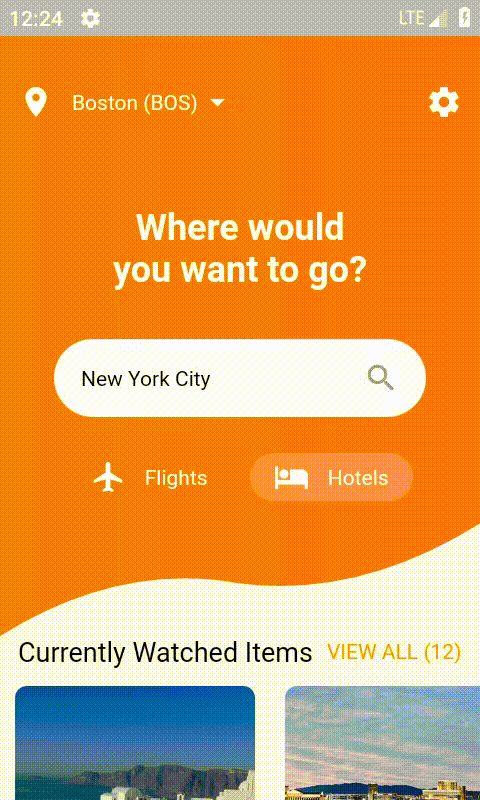
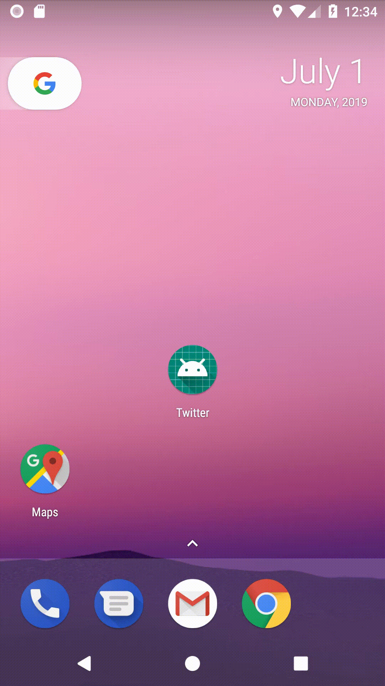
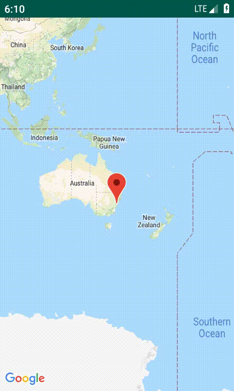
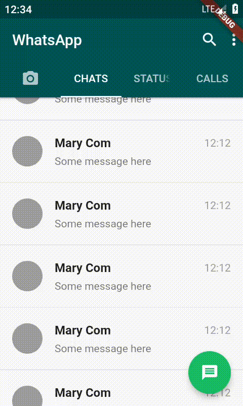

# Tanuj's Project

### Please have a look at the projects.

Android and Flutter Projects.

[</img>](https://github.com/tanuj22333/flight-app"(target|_blank)")

> * Flight App UI: Implemented Flight App ui using Flutter. All round curves are implemented using code to provide consistent experience to all devices. Project uses Dart and Flutter. 

[</img>](https://github.com/tanuj22333/twitter-animation)

> * Twitter Animations: Implemented Twitter Splash and Login screen with Animation. Project uses XML and Java programming language. 
This project uses basic Animation to Animate the screen. No external library is used.;

[</img>](https://github.com/tanuj22333/map-demo)

> * Map: Integrate Google map to Android project. In future will add places service to the project for now only map is integrated. Project uses XML and Java programming language. 

[</img>](https://github.com/tanuj22333/gmail-ui)

[</img>](https://github.com/tanuj22333/whats-app-clone)

## About me:
### My name is Tanuj. I have 3 years of Professional Android development experience and programming for 7 years. In total shipped 7 products to the Google Play Store. 

### Built products for E-commerce, Football, and Health & Pharma companies. 

Best work:
I was working on an e-commerce product. In start, it was like any other e-commerce product but with time realized we are selling some items that are not allowed to sell by law in all the U.S states. 

So, in short, we can sell it only in the allowed states so we decided to restrict the access to the not allowed states. 

Now we need to implement location services but we don't listen to location all the time so we can save the battery life of the device. 

Solution: implemented Geo-location if the user is in the allowed states application work as expected if is in not allowed states application shows "Not allowed message"

These projects do not have as much documentation as I want to add. I will continue to work on these and improve with time.

Connect with me through Skype: https://join.skype.com/invite/dOAhIdaIdocC
