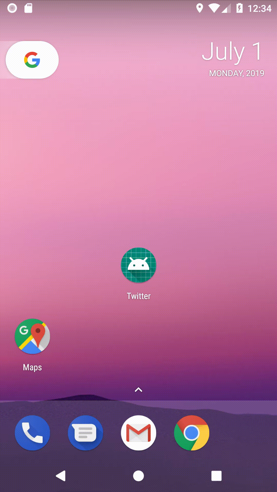

# Tanuj's Project's

### Please have a look at the proejcts.

Projects are mainly in Android and Flutter.

[</img>](https://github.com/tanuj22333/twitter-animation)

This project use basic Animation to Animate the screen. No external liberay is used.;

> * Twitter Animations: Implemented Twitter Spalsh and Login screen with Animation. Project uses XML and Java programming language. 

## About me:
### My name is Tanuj. I have 3 years of Andrid development experiecen and programming for 7 years. In total shipped 7 products to the Google Play Store. 

### Built products for E-commerce and football companies. 

Best work:
I was working on a e-commerce products. In start it was like a any other e-commerce product but with time realized we are selling some items are not allowed by law in the U.S states. 

So in short we can sell in allowed states and we deceided to restric the access to the not allowed states. 

Now we need impemtment location services but we don't listen to location all the time so we can save battery life of the device. 
Solution: implemented Geo-location if user is in the allowed states application work as expected if is in not allowed states application shows "Not allowed message"
